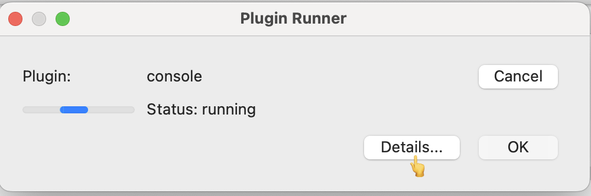
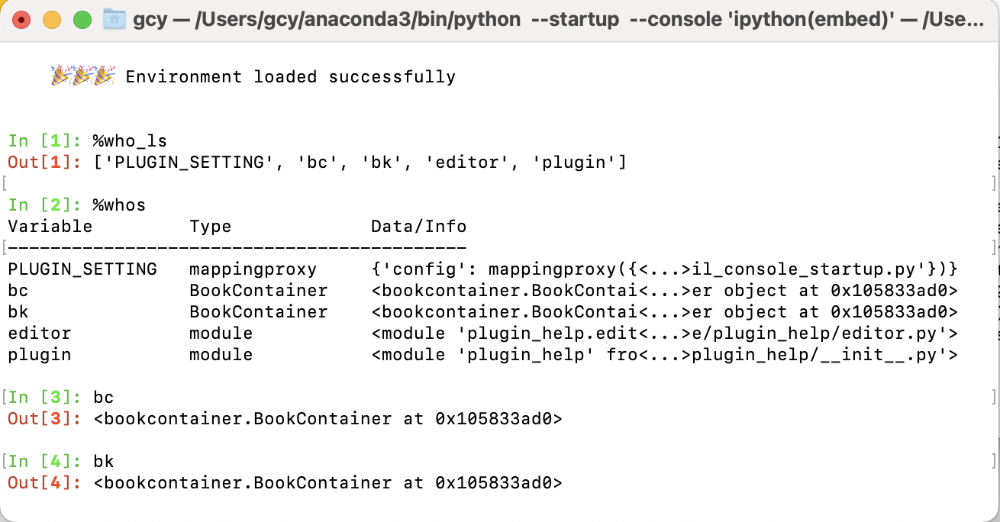

# sigil-console

[sigil-console](https://github.com/ChenyangGao/sigil-console) 是一个 [Sigil](https://github.com/Sigil-Ebook/Sigil) 插件，可以在控制台中交互式地输入并运行 [python](https://www.python.org/) 代码。利用 [Sigil](https://github.com/Sigil-Ebook/Sigil) 提供的 [python 接口](https://github.com/Sigil-Ebook/Sigil/blob/master/src/Resource_Files/plugin_launchers/python/)，可以读写当前正在用 [Sigil](https://github.com/Sigil-Ebook/Sigil) 操作的 [ePub](http://idpf.org/epub) 书。

## 配置

运行插件后，只要当前的 [python](https://www.python.org/) 执行环境的 [tkinter](https://docs.python.org/3/library/tkinter.html) 模块可用，则会弹出如下的配置界面。


如果用鼠标在上面的配置界面中的一些地方悬停几秒，就会弹出相应的提示说明，你可以通过阅读这些提示说明，来了解如何进行配置。  
配置完成后，**直接关闭**配置界面的窗口，就会生效。

## 基本操作

### 1. 选择并进入 console

在配置界面中选择一个特定的 <kbd>console</kbd> 后，关闭窗口，就会自动打开对应的 <kbd>console</kbd>。


我个人推荐你选择 [`ipython`](https://ipython.readthedocs.io/en/latest/)，后面的示例代码我都会用 [`ipython`](https://ipython.readthedocs.io/en/latest/) 执行。

如果没有自动加载环境，就需要你手动加载。你也可以在 <kbd>console</kbd> 中运行一个 `sigil_console_startup.py` 文件，来加载环境。`sigil_console_startup.py` 文件的路径如下图（每一次运行插件后，路径都不同）：




### 2. 退出 console

退出需要运行专门的命令，直接关闭窗口可能会<kbd>**丢弃修改**</kbd>。  
所有的 <kbd>console</kbd> 中，你都可以通过运行（输入后回车） `exit`、`exit()` 或 `plugin.exit()` 命令退出。  
有些支持输入 <kbd>Ctrl</kbd>-<kbd>D</kbd> 或 <kbd>Ctrl</kbd>-<kbd>Q</kbd> 组合键退出。但在 `idle*` 和 `euporie` 下，会<kbd>**丢弃修改**</kbd>。  
`jupyter lab` 和 `jupyter notebook` 打开后，会先打开一个命令行终端，再在终端运行一个网页服务，你写代码是在网页上，但需要在命令行终端输入 <kbd>Ctrl</kbd>-<kbd>C</kbd> 退出。

### 3. 运行命令

在命令行中输入 [python](https://www.python.org/) 代码或命令，回车后就会运行。这里所谓的命令行，运行着上面提到的某个 <kbd>console</kbd>，并有着一种称为 [REPL](https://en.wikipedia.org/wiki/Read%E2%80%93eval%E2%80%93print_loop) 的运行方式，提供了一种反复地【输入-运行-输出】的交互式工作流程。

下图展示了，在 [ipython](https://ipython.readthedocs.io/en/latest/) <kbd>console</kbd> 中运行了几个命令：


### 4. 调用 Sigil 的 python 接口

具体有哪些接口，可参考文档 [Routines to Access and Manipulate OPF elements](https://fossies.org/linux/Sigil/docs/Sigil_Plugin_Framework_rev14.epub#sigil_python_plugins.html#sigil_toc_id_1)，你可以在 `bc` 或者 `bk` 上调用这些接口，`bc` 和 `bk` 是同一个东西，只是名字不同，你可以根据喜好选用其一。

```python
In [1]: bc
Out[1]: <bookcontainer.BookContainer at 0x108c41fc0>

In [2]: bk
Out[2]: <bookcontainer.BookContainer at 0x108c41fc0>

In [3]: list(bc.text_iter())
Out[3]: [('Section0001.xhtml', 'Text/Section0001.xhtml')]
```

### 5. plugin.*

我提供了很多帮助函数，作为全局变量 plugin 的属性提供，可阅读来了解[文档](https://sigil-console.readthedocs.io/en/latest/reference/plugin.html)，也可以用 [`help()`](https://docs.python.org/3/library/functions.html#help) 函数来查看说明文档。


### 6. editor.*

我提供了很多便于操作 ePub 的函数，作为全局变量 editor 的属性提供，可阅读来了解[文档](https://sigil-console.readthedocs.io/en/latest/reference/editor.html)，也可以用 [`help()`](https://docs.python.org/3/library/functions.html#help) 函数来查看说明文档。


### 7. 安装和删除模块

当前的 [python](https://www.python.org/) 环境中有 [`pip`](https://pypi.org/project/pip/) 时，可以使用 `plugin.install()` 函数安装第三方模块，`plugin.uninstall()` 函数删除第三方模块。

## 使用实例

详细资料，请参考 [官方文档](https://fossies.org/linux/Sigil/docs/Sigil_Plugin_Framework_rev14.epub)。

### 1. 添加和删除文件

1. 运行下面的命令，可以在当前正在操作的 [ePub](http://idpf.org/epub) 书中添加一个 id 和 名字 为 `Sectionxxxx.xhtml` 的文件：

```python
text = '''<?xml version="1.0" encoding="utf-8"?>
<!DOCTYPE html PUBLIC "-//W3C//DTD XHTML 1.1//EN"
  "http://www.w3.org/TR/xhtml11/DTD/xhtml11.dtd">

<html xmlns="http://www.w3.org/1999/xhtml">
<head>
  <title></title>
</head>

<body>
  <p>&nbsp;</p>
</body>
</html>'''

fileid = filename = 'Sectionxxxx.xhtml'
# 可以省略 mime 参数，如此会自动根据后缀名判断 mimetype
bc.addfile(fileid, filename, text, mime='application/xhtml+xml')
```

2. 运行下面的命令，可以删除一个 id 为 `Sectionxxxx.xhtml` 的文件：
```python
bc.deletefile('Sectionxxxx.xhtml')
```

### 2. 读写文件

1. 运行下面的命令，可以读取一个 id 为 `Sectionxxxx.xhtml` 的文件内容：
```python
bc.readfile('Sectionxxxx.xhtml')
```

2. 运行下面的命令，可以修改一个 id 为 `Sectionxxxx.xhtml` 的文件内容：
```python
text = '''<?xml version="1.0" encoding="utf-8"?>
<!DOCTYPE html PUBLIC "-//W3C//DTD XHTML 1.1//EN"
  "http://www.w3.org/TR/xhtml11/DTD/xhtml11.dtd">

<html xmlns="http://www.w3.org/1999/xhtml">
<head>
  <title></title>
</head>

<body>
  <p>&nbsp;</p>
</body>
</html>'''

bc.writefile('Sectionxxxx.xhtml', text)
```
